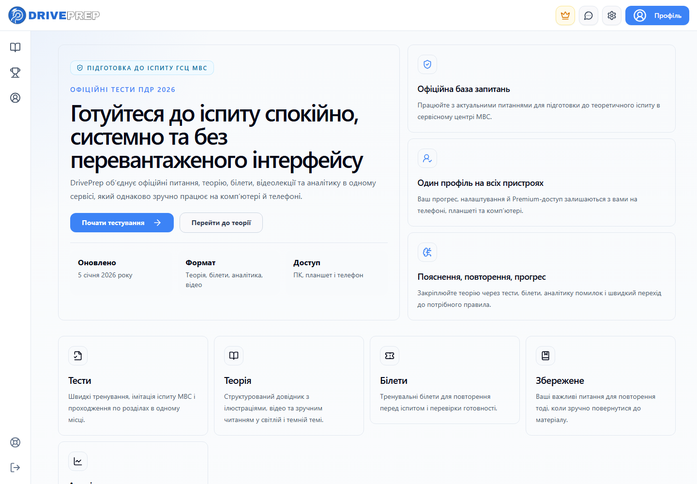
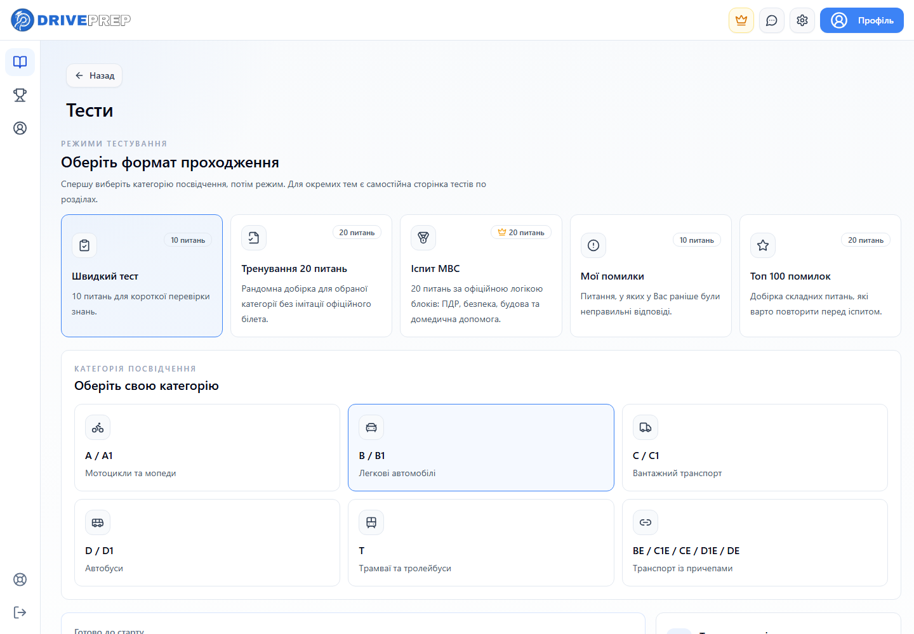
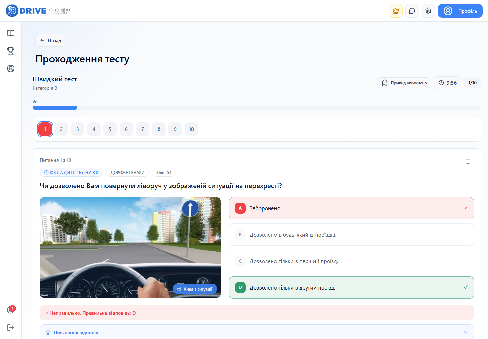
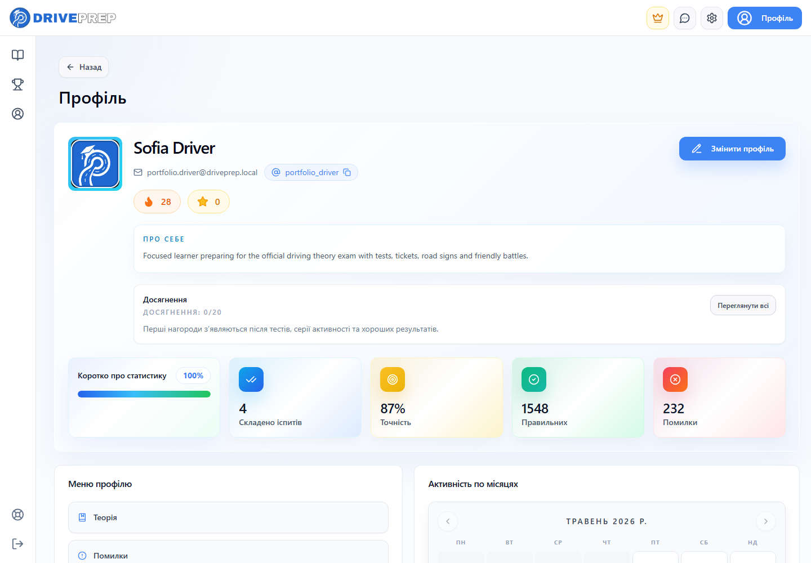
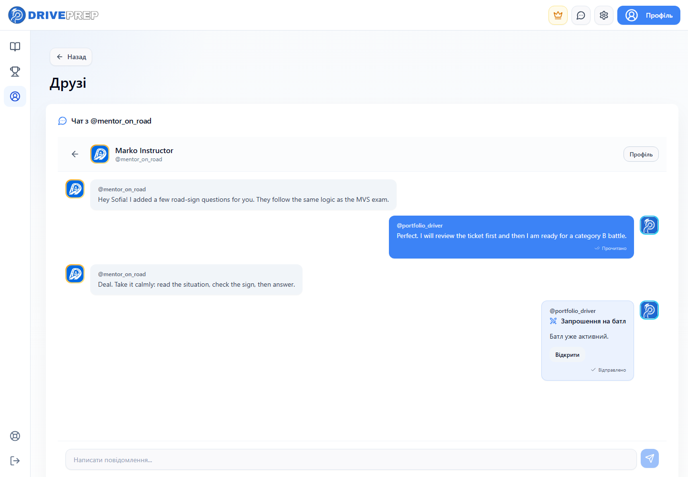
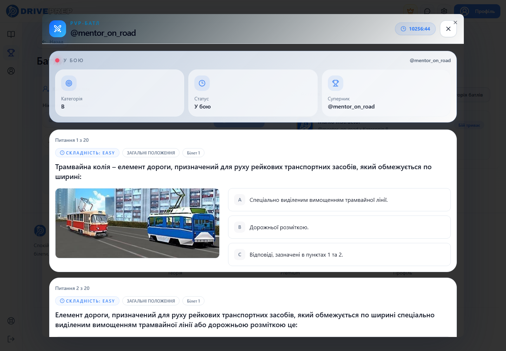
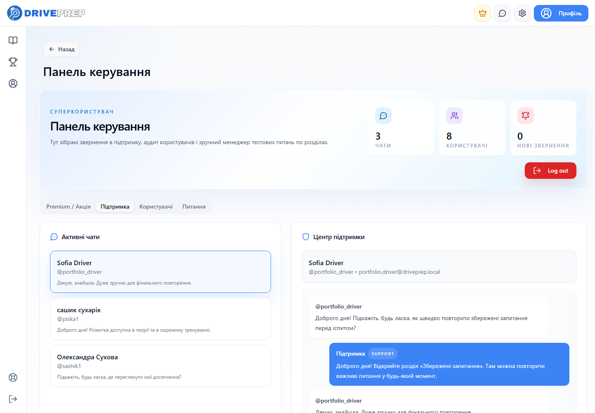
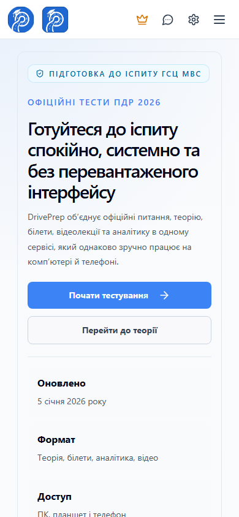

# DrivePrep — Driving Theory Exam Platform


DrivePrep is a fullstack web platform for preparing for the Ukrainian driving theory exam.  
The product combines official-style tests, MVS exam simulation, theory sections, tickets, progress analytics, friends, chats, battles, premium access and a responsive mobile-first interface.

The goal of this project is to make exam preparation feel structured, calm and modern instead of overloaded and stressful.

---

## ✨ Features

- Official-style PDR question training
- MVS exam simulation with category-based tickets
- Theory library with road signs, road markings and parsed learning content
- Section-based tests and quick practice modes
- Saved questions for personal revision
- User authentication and profile customization
- Progress dashboard, achievements and activity tracking
- Friends system with private chat
- Real-time style battle mode between users
- Premium access layer for advanced training flows
- Light and dark theme support
- Responsive UI for desktop and mobile

---

## 🧰 Tech Stack

**Frontend**

- React 18
- Vite
- Tailwind CSS
- Framer Motion
- TanStack Query
- React Router
- shadcn/ui-style component layer

**Backend**

- Python
- FastAPI
- PostgreSQL
- JWT authentication
- REST API architecture
- Local media uploads
- Data parsers for theory content

**Product / UX**

- Mobile-first layouts
- Dark mode
- Clean dashboard UI
- Interactive quizzes
- Chat and battle flows
- Premium-style interface polish

---

## 📸 Screenshots

### Home Page



### Tests Page



### Test Question



### User Profile



### Friends Chat



### Battle Mode



### Admin Panel



### Mobile View



---

## 🏗️ Project Structure

```text
PDRPrep/
│
├── frontend/
│   ├── public/
│   ├── src/
│   │   ├── api/
│   │   ├── components/
│   │   ├── features/
│   │   ├── lib/
│   │   └── pages/
│   └── package.json
│
├── backend/
│   ├── api/
│   ├── config/
│   ├── parsers/
│   ├── schemas/
│   ├── services/
│   ├── scripts/
│   └── main.py
│
├── screenshots/
│   ├── home-page.png
│   ├── tests-page.png
│   ├── test-question.png
│   ├── profile-page.png
│   ├── friends-chat.png
│   ├── battle-mode.png
│   ├── admin-panel.png
│   └── mobile-view.png
│
├── docs/
├── README.md
├── .gitignore
└── package.json
```

---

## 🚀 Live Demo

Deployment link: [https://driveprep-pdr.onrender.com](https://driveprep-pdr.onrender.com)

Repository: [github.com/sashik117/pdr_prep](https://github.com/sashik117/pdr_prep)

Local preview:

```bash
http://127.0.0.1:5177
```

---

## ⚙️ Installation

Clone the repository:

```bash
git clone https://github.com/sashik117/pdr_prep.git
cd pdr_prep
```

Install frontend dependencies:

```bash
cd frontend
npm install
npm run dev
```

Start the backend:

```bash
cd backend
python -m venv venv
venv\Scripts\activate
pip install -r requirements.txt
python -m uvicorn main:app --reload
```

Create a backend `.env` file from the example:

```bash
copy backend\.env.example backend\.env
```

---

## 🧪 Useful Scripts

```bash
npm run dev
npm run build
npm run typecheck
```

Frontend only:

```bash
cd frontend
npm run dev
npm run build
npm run typecheck
```

Render deploy:

```bash
# The Blueprint uses Docker.
# Frontend build: npm ci --include=dev && npm run build
# Pre-deploy: python backend/scripts/render_migrate.py
# Backend start: uvicorn main:app
render.yaml
```

---

## 🎯 Product Goals

DrivePrep was built as a realistic fullstack product, not just a practice project.  
It focuses on clear learning flows, structured exam preparation, user progress, social learning and a polished responsive interface.

Key product goals:

- reduce stress during exam preparation
- make theory easier to revisit
- keep tests fast and intuitive
- give users visible progress and motivation
- support both desktop and mobile learning

---

## 👤 Contact

GitHub: [sashik117](https://github.com/sashik117)  
Repository: [pdr_prep](https://github.com/sashik117/pdr_prep)

---

## ⭐ Portfolio Note

Recommended clean repository name:

```text
driveprep-platform
```

This project is designed to work as a strong fullstack portfolio case: React frontend, FastAPI backend, PostgreSQL database, authentication, user interaction, gamified testing and responsive product-level UI.
